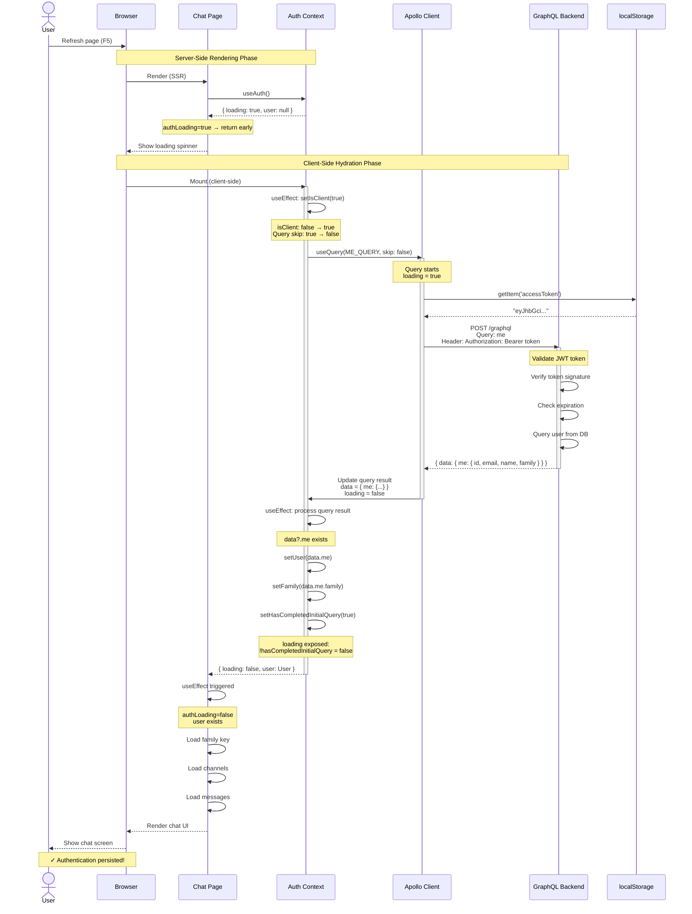
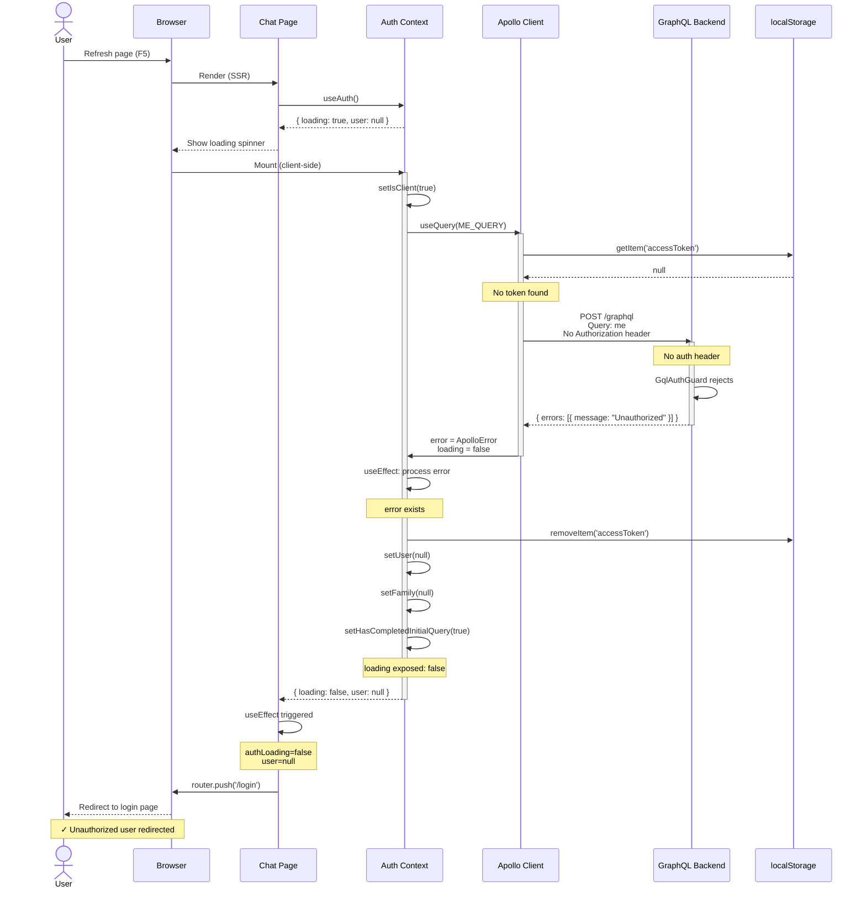
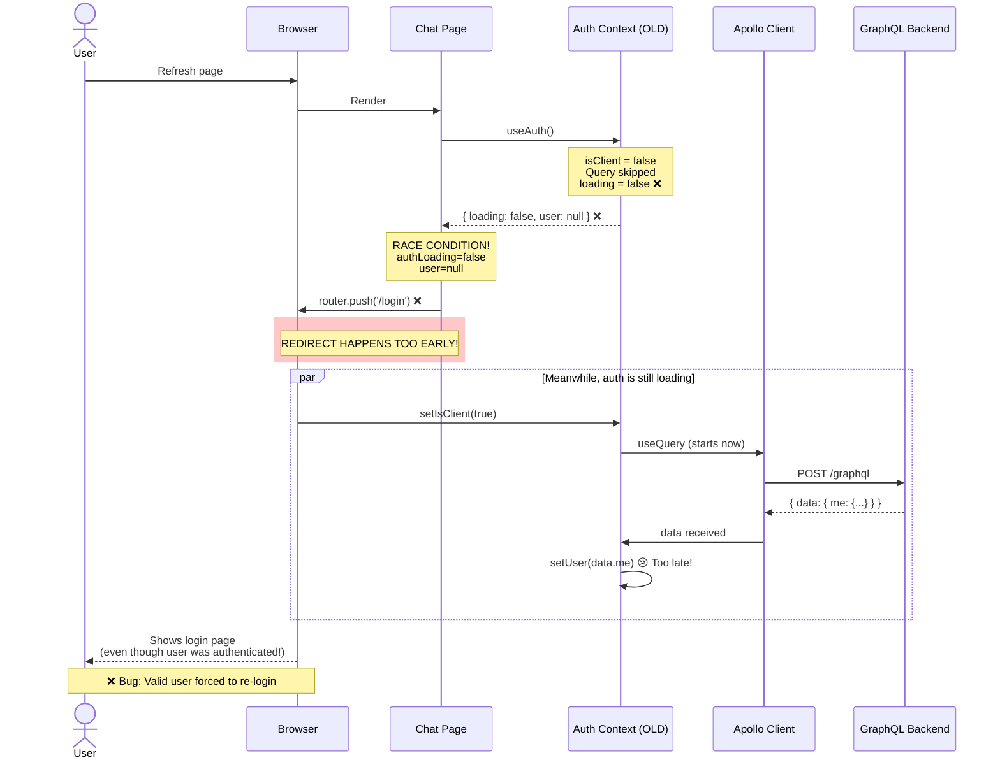
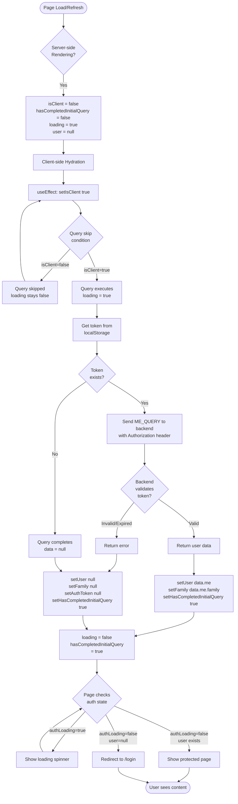

# Authentication Persistence Flow

This document explains how authentication persistence works across page refreshes in OurChat.

## Problem Statement

When a user refreshes the page, the application needs to:
1. Check if they have a valid authentication token in localStorage
2. Fetch their user data from the backend
3. Only redirect to login if they're actually unauthenticated
4. Avoid race conditions that cause premature redirects

## The Race Condition We Fixed

**Original Issue**: Page would briefly load chat, then redirect to login even with a valid token.

**Root Cause**: The `loading` state would become `false` before the user was fetched, causing the chat page to see `authLoading=false` with `user=null` and immediately redirect.

**Sequence of the bug**:
```
1. Page loads → isClient=false, loading=false (query skipped), user=null
2. Chat page checks → authLoading=false AND user=null → REDIRECT TO LOGIN ❌
3. Then isClient=true → query runs → user fetched (but too late!)
```

## Solution: hasCompletedInitialQuery Flag

We track whether the initial authentication query has completed at least once. The `loading` state stays `true` until this flag is set, preventing premature routing decisions.

## Sequence Diagram

This diagram shows the interaction between components over time during a page refresh with a valid authentication token.



### Failed Authentication Sequence

This diagram shows what happens when the token is invalid or missing.



### Race Condition (Before Fix)

This diagram shows the bug that existed before implementing `hasCompletedInitialQuery`.



## Authentication Flow Diagram



## Key State Variables

### In AuthContext (`src/lib/contexts/auth-context.tsx`)

| Variable | Type | Purpose |
|----------|------|---------|
| `isClient` | boolean | Tracks if we're on client-side (not SSR) |
| `hasCompletedInitialQuery` | boolean | Tracks if initial auth check completed |
| `user` | User \| null | Current authenticated user |
| `family` | Family \| null | User's family data |
| `loading` (exposed) | boolean | `!hasCompletedInitialQuery` - True until first query completes |

### Query Configuration

```typescript
useQuery(ME_QUERY, {
  skip: !isClient,                    // Only run on client-side
  fetchPolicy: 'network-only',        // Always fetch fresh, ignore cache
  errorPolicy: 'all',                 // Handle errors gracefully
  notifyOnNetworkStatusChange: true   // Get loading state updates
})
```

## Code Flow

### 1. Initial State (SSR + Client Mount)

```typescript
// Server-side and initial client render
isClient = false                     // Not client-side yet
hasCompletedInitialQuery = false     // Haven't checked auth yet
user = null                          // No user data
loading (exposed) = true             // Still loading (based on !hasCompletedInitialQuery)
```

### 2. Client-Side Activation

```typescript
// useEffect runs on client mount
useEffect(() => {
  setIsClient(true);  // Triggers query to run
}, []);
```

### 3. Query Execution

```typescript
// Query starts because isClient=true and skip=false
const { data, loading, error } = useQuery(ME_QUERY, {
  skip: !isClient  // Now false, so query runs
});
```

### 4. Query Completion Handler

```typescript
useEffect(() => {
  if (!isClient || loading) return;

  // Mark that initial query completed
  setHasCompletedInitialQuery(true);

  if (error) {
    // Token invalid/expired - clear auth
    setAuthToken(null);
    setUser(null);
    setFamily(null);
  } else if (data?.me) {
    // User authenticated - set state
    setUser(data.me);
    setFamily(data.me.family);
  } else {
    // No user - clear state
    setUser(null);
    setFamily(null);
  }
}, [data, error, loading, isClient]);
```

### 5. Loading State Computation

```typescript
// Exposed to consuming components
return (
  <AuthContext.Provider
    value={{
      user,
      family,
      loading: !hasCompletedInitialQuery,  // True until first check completes
      // ... other values
    }}
  >
    {children}
  </AuthContext.Provider>
);
```

### 6. Protected Page Logic (`src/app/chat/page.tsx`)

```typescript
useEffect(() => {
  if (authLoading) {
    // Still checking auth - wait
    return;
  }

  if (!user) {
    // Auth check complete, no user - redirect
    router.push('/login');
    return;
  }

  // User authenticated - continue loading page
  // ... load family key, channels, etc.
}, [user, authLoading, router]);
```

## Timeline Example

**Successful authentication flow:**

```
T=0ms:   Page loads
         - SSR renders with isClient=false, loading=true, user=null

T=10ms:  Client hydrates
         - useEffect sets isClient=true

T=15ms:  Query starts
         - ME_QUERY sends request with token from localStorage
         - loading (internal) = true
         - loading (exposed) = true (hasCompletedInitialQuery=false)

T=50ms:  Backend responds
         - User data received

T=55ms:  useEffect processes response
         - setUser(data.me)
         - setFamily(data.me.family)
         - setHasCompletedInitialQuery(true)
         - loading (exposed) = false

T=60ms:  Chat page useEffect sees authLoading=false, user exists
         - Continues loading chat (no redirect)

T=100ms: Chat fully loaded
```

**Failed authentication flow (no token):**

```
T=0ms:   Page loads
T=10ms:  Client hydrates → isClient=true
T=15ms:  Query starts but no token in localStorage
T=20ms:  Query completes with data=null
T=25ms:  useEffect: setHasCompletedInitialQuery(true), user stays null
         - loading (exposed) = false
T=30ms:  Chat page sees authLoading=false, user=null
         - Redirects to /login ✓
```

## Key Insights

1. **Why skip the query on SSR?**
   - `localStorage` doesn't exist on the server
   - Prevents server/client hydration mismatches
   - Tokens are client-side only

2. **Why use `fetchPolicy: 'network-only'`?**
   - Ensures we always check token validity with backend
   - Prevents stale cache from showing outdated auth state
   - Critical for security - don't trust cached auth data

3. **Why track `hasCompletedInitialQuery` separately?**
   - Apollo's `loading` state can be `false` before query even starts (when `skip=true`)
   - We need to distinguish "hasn't started yet" from "completed"
   - Prevents race condition where page redirects before auth check finishes

4. **Why use `useEffect` instead of `onCompleted/onError`?**
   - Apollo callbacks don't fire reliably when using `skip`
   - `useEffect` watching `data/error/loading` is more reliable
   - Works consistently across all query states

## Related Files

- `/src/lib/contexts/auth-context.tsx` - Authentication context implementation
- `/src/app/chat/page.tsx` - Example of protected page using auth
- `/src/lib/graphql/client.ts` - Apollo Client configuration with auth link
- `/apps/backend/src/auth/auth.resolver.ts` - Backend ME_QUERY resolver

## Troubleshooting

### Issue: Page still redirects to login after refresh

**Check:**
1. Is token in localStorage? (`localStorage.getItem('accessToken')`)
2. Is backend receiving the Authorization header?
3. Is token expired? (Check backend logs)
4. Is `hasCompletedInitialQuery` being set to `true`?

**Debug logs to add:**
```typescript
console.log('[AuthContext] hasCompletedInitialQuery:', hasCompletedInitialQuery);
console.log('[AuthContext] loading exposed:', !hasCompletedInitialQuery);
console.log('[ChatPage] authLoading:', authLoading, 'user:', user?.email);
```

### Issue: Page flashes login screen then shows chat

This is expected! The flow is:
1. Show loading spinner (authLoading=true)
2. Query completes
3. Show appropriate page

If you're seeing a flash of the login form, check that the loading state is being properly rendered.

## Future Improvements

1. **Token refresh**: Implement automatic token refresh before expiration
2. **Optimistic persistence**: Consider storing user data in localStorage for instant load
3. **Background revalidation**: Periodically revalidate auth even when page is active
4. **Better loading UX**: Show skeleton screens instead of generic loading spinner
